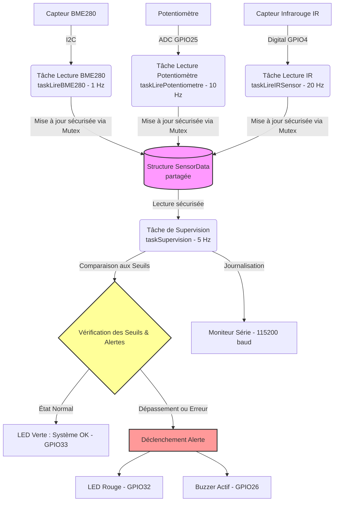

# 📌 Atelier Jour 3 - Physical AI
## Acquisition multi-capteurs avec FreeRTOS sur ESP32

Ce dossier contient le projet pratique du Jour 3 de l'atelier **Physical AI**, axé sur le développement d'un système d'acquisition multi-capteurs multitâche temps réel à l'aide de **FreeRTOS** sur un microcontrôleur **ESP32**.

Le projet principal se trouve dans le sous-dossier : [`atelier jour 3`](file:///Users/hafida/Documents/Physical-AI---ABA-Fusion/Jour%203/atelier%20jour%203)

---

## ⚙️ Architecture Système & Conception Logicielle

Le projet exploite le multitâche offert par **FreeRTOS** sur l'architecture double-cœur de l'**ESP32**. L'accès concurrent aux données partagées entre les différentes tâches est sécurisé à l'aide d'un verrou d'exclusion mutuelle (**Mutex Semaphore**) afin d'éviter tout conflit de mémoire (Race Conditions).

### 📊 Diagramme de Flux et de Tâches (Mermaid)



---

## 🔌 Câblage & Brochage (Pin Mapping)

Le circuit et ses composants ont été modélisés pour la simulation sur **Wokwi**. Le tableau suivant récapitule les connexions physiques avec la carte de développement **ESP32 (uPesy Wroom DevKit)** :

| Composant | Type de Signal | Broche ESP32 (GPIO) | Description |
| :--- | :--- | :--- | :--- |
| **Capteur BME280** | I2C (SDA) | **GPIO 21** | Ligne de données (Température, Humidité, Pression) |
| **Capteur BME280** | I2C (SCL) | **GPIO 22** | Ligne d'horloge de synchronisation |
| **Potentiomètre** | Analogique | **GPIO 25** | Signal analogique pour simuler une consigne (0 - 4095) |
| **Capteur Infrarouge (IR)** | Digital | **GPIO 4** | Détection d'obstacle (entrée avec résistance de tirage) |
| **LED Verte** | Digital | **GPIO 33** | Indicateur d'état système : Fonctionnement normal (OK) |
| **LED Rouge** | Digital | **GPIO 32** | Indicateur d'état système : Alerte |
| **Buzzer** | Digital | **GPIO 26** | Alerte sonore active en cas de danger/dépassement |

---

## 🧠 Détails des Tâches FreeRTOS

Les tâches s'exécutent de façon concurrente avec des périodes et des priorités adaptées à la dynamique de chaque capteur :

1. **Lecture du BME280 (`taskLireBME280`)** :
   - **Fréquence** : 1 Hz (toutes les 1000 ms).
   - **Rôle** : Récupère la température, l'humidité et la pression. Comme le BME280 est un capteur physiquement lent, une faible fréquence de rafraîchissement permet d'alléger la charge du processeur.
   - **Taille de pile (Stack Size)** : 4096 octets.

2. **Lecture du Potentiomètre (`taskLirePotentiometre`)** :
   - **Fréquence** : 10 Hz (toutes les 100 ms).
   - **Rôle** : Échantillonne l'entrée ADC et applique un filtre de moyenne mobile sur 5 échantillons consécutifs pour stabiliser le signal. Il calcule ensuite la tension réelle en volts (0 - 3.3V).
   - **Taille de pile (Stack Size)** : 2048 octets.

3. **Lecture du Capteur Infrarouge (`taskLireIRSensor`)** :
   - **Fréquence** : 20 Hz (toutes les 50 ms).
   - **Rôle** : Détecte très rapidement la présence d'un obstacle. Cette tâche requiert une haute réactivité.
   - **Taille de pile (Stack Size)** : 2048 octets.

4. **Supervision & Diagnostic (`taskSupervision`)** :
   - **Fréquence** : 5 Hz (toutes les 200 ms).
   - **Rôle** : Copie les données partagées de manière thread-safe (via Mutex), valide les seuils d'alerte, pilote les LEDs/Buzzer et logue l'état global du système sur le port série (`115200` bauds).
   - **Taille de pile (Stack Size)** : 4096 octets.

---

## 🚨 Logique d'Alerte et Seuils (Alert Logic)

Le système passe en **mode Alerte** si l'une des conditions suivantes est remplie :
* **Température hors limite** : `Température > 23.0 °C`.
* **Valeur potentiomètre élevée** : `Valeur Potentiomètre > 3000` (sur 4095).
* **Obstacle détecté** : Le capteur IR renvoie un état haut `HIGH`.
* **Défaut de capteur** : Le capteur BME280 est introuvable sur le bus I2C (adresse `0x76` ou `0x77`).

**Comportement en cas d'Alerte :**
* La LED Verte est **éteinte**.
* La LED Rouge est **allumée**.
* Le Buzzer est **activé**.

**Comportement en état Normal :**
* La LED Verte est **allumée**.
* La LED Rouge est **éteinte**.
* Le Buzzer est **désactivé**.

---

## 🛠️ Compilation & Simulation

Vous pouvez compiler et simuler ce projet sans aucun matériel physique grâce à **PlatformIO** et l'intégration de l'émulateur **Wokwi**.

### 1. Prérequis Logiciels
* **Visual Studio Code (VS Code)**.
* L'extension **PlatformIO IDE** pour VS Code.
* L'extension **Wokwi Simulator** pour VS Code.

### 2. Compilation
1. Ouvrez le dossier `atelier jour 3` dans VS Code.
2. PlatformIO téléchargera automatiquement les dépendances définies dans `platformio.ini` :
   - `Adafruit BME280 Library`
   - `Adafruit Unified Sensor`
3. Lancez la compilation en cliquant sur l'icône en forme de coche (✓) en bas de la fenêtre de VS Code ou via le terminal PlatformIO :
   ```bash
   pio run
   ```

### 3. Simulation Wokwi
Le dossier contient les configurations nécessaires :
* [`diagram.json`](file:///Users/hafida/Documents/Physical-AI---ABA-Fusion/Jour%203/atelier%20jour%203/diagram.json) : Contient l'agencement graphique et les branchements des composants virtuels.
* [`wokwi.toml`](file:///Users/hafida/Documents/Physical-AI---ABA-Fusion/Jour%203/atelier%20jour%203/wokwi.toml) : Fait le lien vers les fichiers binaires compilés par PlatformIO (`firmware.bin` / `firmware.elf`).

Pour démarrer la simulation :
1. Ouvrez le fichier `diagram.json`.
2. Cliquez sur le bouton de lecture (**Play**) ou lancez la commande via la palette d'actions (`Cmd+Shift+P` -> `Wokwi: Start Simulator`).
3. Pendant la simulation, vous pouvez interagir en direct :
   - Ajuster la température et l'humidité sur le boîtier BME280 virtuel.
   - Tourner le bouton du potentiomètre virtuel.
   - Déclencher le capteur IR pour simuler la présence d'obstacles et observer les réactions instantanées du système d'alarme.
