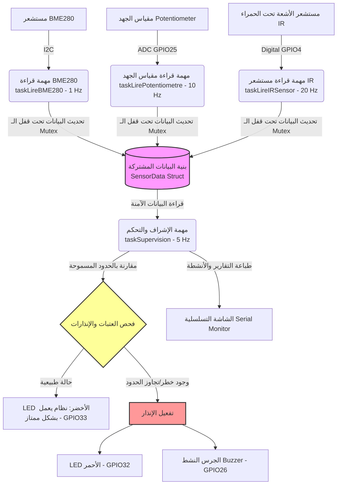

# 📌 ورشة العمل: اليوم 3 - الذكاء الاصطناعي الفيزيائي (Physical AI)
## نظام استحصال بيانات متعدد المستشعرات باستخدام FreeRTOS على متحكم ESP32

يحتوي هذا المجلد على مشروع عملي متكامل لليوم الثالث من ورشة عمل **الذكاء الاصطناعي الفيزيائي (Physical AI)**، والذي يركز على تصميم وبرمجة نظام مستند إلى نظام التشغيل في الوقت الحقيقي **FreeRTOS** لتجميع وقراءة البيانات من عدة مستشعرات ومعالجتها في وقت واحد وبشكل متوازٍ دون حدوث تعارض أو تأخير.

مشروع الورشة يقع في المجلد: [`atelier jour 3`](file:///Users/hafida/Documents/Physical-AI---ABA-Fusion/Jour%203/atelier%20jour%203)

---

## ⚙️ بنية النظام وهندسة البرمجيات (System Architecture)

يعتمد المشروع على تقنية **تعدد المهام (Multitasking)** باستخدام **FreeRTOS** على معالج **ESP32** ثنائي النواة. تتم حماية البيانات المشتركة بين المهام المختلفة باستخدام **مؤشر التزامن (Mutex Semaphore)** لمنع حدوث تعارض في الوصول إلى الذاكرة (Race Conditions).

### 📊 مخطط تدفق البيانات والمهام (Mermaid Diagram)



---

## 🔌 التوصيلات وتوزيع الدبابيس (Pin Mapping)

تم تصميم التوصيلات ومحاكاتها باستخدام منصة **Wokwi**. فيما يلي جدول يوضح كيفية ربط القطع الإلكترونية مع لوحة التطوير **ESP32 (uPesy Wroom DevKit)**:

| المكون الإلكتروني | نوع الإشارة | منفذ الـ ESP32 (GPIO) | الوصف |
| :--- | :--- | :--- | :--- |
| **مستشعر BME280** | I2C (SDA) | **GPIO 21** | خط بيانات مستشعر الحرارة، الرطوبة، والضغط الجوي |
| **مستشعر BME280** | I2C (SCL) | **GPIO 22** | خط ساعة التزامن للمستشعر |
| **مقياس الجهد (Potentiometer)** | Analog | **GPIO 25** | إشارة تماثلية لمحاكاة قيم متغيرة (0 - 4095) |
| **مستشعر الأشعة تحت الحمراء (IR)** | Digital | **GPIO 4** | اكتشاف العوائق والأجسام المقتربة |
| **LED الأخضر (Green LED)** | Digital | **GPIO 33** | مؤشر الضوء الأخضر (حالة النظام: طبيعي وسليم) |
| **LED الأحمر (Red LED)** | Digital | **GPIO 32** | مؤشر الضوء الأحمر (حالة النظام: إنذار/خطر) |
| **الجرس (Buzzer)** | Digital | **GPIO 26** | إنذار صوتي يصدر صوتاً عند وجود خطر |

---

## 🧠 تفاصيل مهام FreeRTOS (Task Details)

يتم توزيع المهام بناءً على التردد والاحتياج الزمني لكل مستشعر كالتالي:

1. **مهمة قراءة BME280 (`taskLireBME280`)**:
   - **التردد**: 1 هرتز (مرة كل 1000 ملي ثانية).
   - **الهدف**: قراءة قيم الحرارة والرطوبة والضغط الجوي. يعتبر هذا المستشعر بطيئ الاستجابة لذا تم ضبطه على تردد منخفض لتوفير موارد المعالج.
   - **حجم المكدس (Stack Size)**: 4096 بايت.

2. **مهمة قراءة مقياس الجهد (`taskLirePotentiometre`)**:
   - **التردد**: 10 هرتز (مرة كل 100 ملي ثانية).
   - **الهدف**: قراءة الإشارة التماثلية وتطبيق مرشح المتوسط المتحرك (Moving Average Filter) على 5 عينات متتالية لتقليل الضوضاء البرمجية الناتجة عن الـ ADC، ثم تحويل القيمة الرقمية المفلترة إلى جهد كهربائي بالفولت (0 - 3.3V).
   - **حجم المكدس (Stack Size)**: 2048 بايت.

3. **مهمة قراءة مستشعر الأشعة تحت الحمراء (`taskLireIRSensor`)**:
   - **التردد**: 20 هرتز (مرة كل 50 ملي ثانية).
   - **الهدف**: الكشف السريع جداً عن العوائق كونه مستشعراً حرجاً يتطلب استجابة سريعة.
   - **حجم المكدس (Stack Size)**: 2048 بايت.

4. **مهمة الإشراف والتحكم (`taskSupervision`)**:
   - **التردد**: 5 هرتز (مرة كل 200 ملي ثانية).
   - **الهدف**: نسخ بيانات المستشعرات بشكل آمن باستخدام الـ Mutex، وفحص الشروط الحدودية وتفعيل المخارج والمؤشرات والإنذارات، بالإضافة إلى كتابة تقرير اللحظي (Log) وإرساله عبر الواجهة التسلسلية بـسرعة نقل `115200` باود.
   - **حجم المكدس (Stack Size)**: 4096 بايت.

---

## 🚨 منطق الإنذار وفحص العتبات (Alert Logic)

ينتقل النظام إلى **وضع الإنذار (Alert State)** إذا تحقق أحد الشروط التالية:
* **تجاوز درجة الحرارة الحد المسموح به**: `Temperature > 23.0 °C`.
* **تجاوز قيمة مقياس الجهد القيمة المحددة**: `Potentiometer Value > 3000` (من أصل 4095).
* **اكتشاف عائق بواسطة مستشعر IR**: استقبال إشارة منطقية عالية `HIGH`.
* **فشل الاتصال بمستشعر BME280**: عدم استجابة المستشعر على قنوات الـ I2C.

**رد فعل النظام عند الإنذار:**
* إيقاف تشغيل **LED الأخضر**.
* تشغيل **LED الأحمر** بشكل مستمر.
* تشغيل **الجرس (Buzzer)** بشكل مستمر.

**في الحالة الطبيعية (Normal State):**
* تشغيل **LED الأخضر**.
* إيقاف تشغيل **LED الأحمر** والـ **Buzzer**.

---

## 🛠️ كيفية التشغيل والمحاكاة (Run & Simulation)

يمكن تشغيل هذا المشروع برمجياً ومحاكاته بالكامل دون الحاجة إلى عتاد حقيقي (Hardware) باستخدام **PlatformIO** وملف محاكاة **Wokwi** المرفق.

### 1. المتطلبات البرمجية الأساسية
* بيئة التطوير **Visual Studio Code (VS Code)**.
* إضافة **PlatformIO IDE** لـ VS Code.
* إضافة **Wokwi Simulator** لـ VS Code (أو استخدام موقع Wokwi مباشرة برفع ملفات المشروع).

### 2. البناء والرفع (Build & Compile)
1. افتح مجلد المشروع `atelier jour 3` في VS Code.
2. انتظر حتى يقوم PlatformIO بتحميل المكتبات المطلوبة والمحددة في ملف `platformio.ini` وهي:
   - `Adafruit BME280 Library`
   - `Adafruit Unified Sensor`
3. قم ببناء المشروع بالضغط على علامة الصح (✓) أسفل واجهة VS Code أو عبر تشغيل الأمر التالي في سطر الأوامر الخاص بـ PlatformIO:
   ```bash
   pio run
   ```

### 3. محاكاة المشروع عبر Wokwi
يحتوي المشروع على ملفات التهيئة الجاهزة للمحاكاة:
* [`diagram.json`](file:///Users/hafida/Documents/Physical-AI---ABA-Fusion/Jour%203/atelier%20jour%203/diagram.json): يحدد الدوائر الإلكترونية الموصولة افتراضياً ومواقعها.
* [`wokwi.toml`](file:///Users/hafida/Documents/Physical-AI---ABA-Fusion/Jour%203/atelier%20jour%203/wokwi.toml): يربط المحاكي بملف البناء الثنائي الناتج من PlatformIO (`firmware.bin`).

لتشغيل المحاكاة في VS Code:
1. افتح ملف `diagram.json`.
2. اضغط على زر **Play/Start Simulation** الذي يظهر في الجزء العلوي للملف أو عبر لوحة الأوامر (`Cmd+Shift+P` ثم اختيار `Wokwi: Start Simulator`).
3. يمكنك التفاعل مع المستشعرات الافتراضية أثناء التشغيل:
   - تغيير درجة حرارة الرطوبة/الضغط والحرارة على مستشعر BME280.
   - تحريك منزلق مقياس الجهد (Potentiometer).
   - تفعيل/تعطيل مستشعر الحركة (IR sensor) لرؤية استجابة الإنذارات والـ LEDs بشكل فوري.

---

### 📝 ملاحظات إضافية حول الكود
* **دقة قراءة الـ ADC**: تم إعداد دقة القراءة لتكون 12 بت (`analogReadResolution(12)`) لتعطي مدى قراءة بين `0` و `4095`.
* **معدل الباود**: سرعة الاتصال التسلسلي مهيأة على `115200` باود، تأكد من مطابقتها في شاشة مراقبة الاتصال التسلسلي (Serial Monitor) لقراءة السجلات بشكل صحيح.
