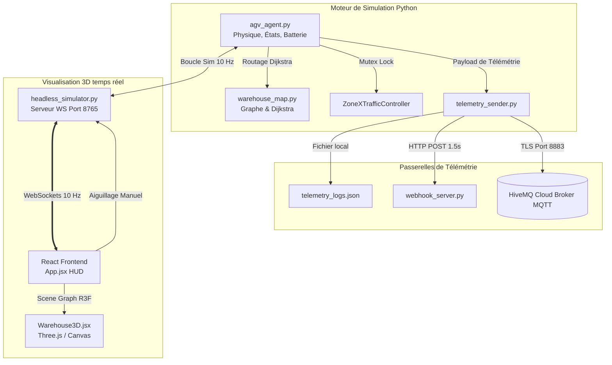

# 🤖 Documentation Technique : Simulateur de Flotte AGV & Jumeau Numérique 3D

**Développé par : Hafida Belayd**  
**Programme : Physical AI - Collaboration ABA Fusion**

---

## 🏗️ Architecture Globale du Système

Ce projet implémente un simulateur multi-agents de véhicules guidés automatisés (AGV) avec une architecture de **Jumeau Numérique** découplée. Le système est composé d'un moteur physique synchrone en Python (Backend) et d'un client de visualisation 3D réactif en React + Three.js (Frontend).



---

## 🧠 Composants du Backend (Python)

Le dossier comprend plusieurs modules Python assurant la simulation physique, le routage spatial, la prévention des collisions et l'envoi de la télémétrie :

### 1. Gestion des Agents AGV ([agv_agent.py](file:///Users/hafida/Documents/Physical-AI---ABA-Fusion/Semain%202/Assignment%2001/agv_agent.py))
Ce fichier définit la classe `AGV` qui gère de manière autonome chaque robot :
* **Machine à États :** Les agents changent d'état dynamiquement (`IDLE`, `EN_ROUTE`, `ARRIVED`, `WAIT`, `STOP`).
* **Physique de la Batterie :** Consommation d'énergie continue lors des déplacements (décharge complète en ~3 minutes d'activité) et recharge rapide (augmentation de 8% par seconde) une fois arrivé à la station de charge **ZONE R**.
* **Physique Thermique :** Échauffement du moteur sous charge (température max limitée à 48.5°C) et refroidissement progressif lors des arrêts ou de la charge.
* **Perte de Connexion Réaliste :** Simule les micro-coupures Wi-Fi des environnements industriels de manière asymétrique (taux d'indisponibilité global de 0.3%, avec reconnexion automatique en moins de 0.5s), permettant à l'AGV de continuer sa navigation physique locale en autonomie (Edge Computing).

### 2. Graphe & Routage Dijkstra ([warehouse_map.py](file:///Users/hafida/Documents/Physical-AI---ABA-Fusion/Semain%202/Assignment%2001/warehouse_map.py))
* **Réseau de Voies :** Représentation du dépôt sous forme de graphe (nœuds et arrêtes interconnectant les zones de chargement A, de déchargement B, de tri C, d'emballage D, de recharge R, et le carrefour central X).
* **Pénalité Dijkstra :** Pour inciter les AGVs à privilégier l'autoroute centrale (nœud X) tout en laissant la possibilité d'utiliser les voies externes en cas de blocage, un coefficient de pénalité de **1.6** est appliqué aux arrêtes périphériques.

### 3. Contrôleur de Trafic Exclusion Mutuelle (Mutex)
La **ZONE X** centrale est une intersection critique qui ne peut accueillir qu'un seul AGV à la fois.
* Le système implémente un verrou de synchronisation thread-safe (`ZoneXTrafficController`) faisant office de **Mutex**.
* L'AGV arrivant aux portes d'accès (nœuds d'entrée `X_N`, `X_S`, `X_W`, `X_E`) demande l'autorisation d'entrer. S'il l'obtient, il traverse. Sinon, il s'arrête instantanément en état `WAIT` jusqu'à libération de la zone.

### 4. Capteurs & Évitement de Collisions
* Chaque AGV possède un cône virtuel de détection de distance frontale de 45° (`distance_front_cm`).
* Si un AGV suiveur détecte un obstacle ou un autre AGV devant lui à moins de **80 cm**, il effectue un arrêt de sécurité (`STOP`).
* Le système filtre et ignore les AGVs circulant en sens inverse (grâce à un décalage géométrique automatique vers la droite de chaque sens de circulation), évitant ainsi les situations de blocage mutuel (deadlock).

### 5. Multi-Passerelles de Télémétrie ([telemetry_sender.py](file:///Users/hafida/Documents/Physical-AI---ABA-Fusion/Semain%202/Assignment%2001/telemetry_sender.py))
Toutes les 1.5 secondes, les données physiques de chaque robot sont envoyées de manière asynchrone via trois canaux parallèles :
* **Fichier JSON local :** Écrit les entrées au format NDJSON dans `telemetry_logs.json`.
* **Webhook HTTP :** Envoie une requête POST contenant le payload JSON vers le serveur récepteur local `webhook_server.py`.
* **Broker MQTT Cloud :** Se connecte de manière sécurisée en TLS (port 8883) à un broker **HiveMQ Cloud**, et publie les données sur le canal `warehouse/agv/telemetry`.

---

## 💻 Interface du Jumeau Numérique 3D (React + R3F)

Situé dans le dossier `/frontend`, l'application Web communique avec le simulateur Python via un canal WebSocket à **10 Hz** (10 trames/seconde) pour un rendu 3D fluide et temps réel.

### 1. Scene Graph 3D ([Warehouse3D.jsx](file:///Users/hafida/Documents/Physical-AI---ABA-Fusion/Semain%202/Assignment%2001/frontend/src/Warehouse3D.jsx))
Rendu matériel sous React Three Fiber (Three.js) :
* Le dépôt est représenté sur un plan 3D avec grillage technique.
* Les zones physiques (A, B, C, D, R) sont matérialisées par des plaques colorées translucides rétroéclairées.
* La **ZONE X** centrale est mise en valeur par un contour épais Terracotta et des bandes hachurées d'avertissement.
* Les AGVs sont modélisés par des blocs robotiques 3D texturés avec des roues pivotantes et un cône lumineux de capteur qui vire au Terracotta clignotant lors du transit dans la ZONE X.
* Les caméras interactives (`OrbitControls`) permettent de pivoter (clic gauche glissé), déplacer le plan (clic droit glissé) et zoomer (molette).

### 2. Tableau de bord HUD interactif ([App.jsx](file:///Users/hafida/Documents/Physical-AI---ABA-Fusion/Semain%202/Assignment%2001/frontend/src/App.jsx))
* **Indicateurs de Performance :** Cartes de télémétrie dotées de barres de progression plates pour la batterie et la vitesse, affichage de la température moteur, de l'odomètre accumulé et de l'état de connexion.
* **Alerte Flash Critique :** Un bandeau d'avertissement rouge clignotant apparaît immédiatement sur la carte de l'AGV dès qu'il pénètre physiquement dans la zone d'intersection centrale X.
* **Commandes Système :** 
  * Bouton **PAUSE/RESUME** : Gèle la boucle physique côté serveur Python tout en maintenant la connexion réseau active.
  * Bouton **STOP FLEET / RESUME FLEET** : Déclenche l'arrêt d'urgence général (E-Stop).
* **Aiguillage Manuel (Manual Dispatch) :**
  * Chaque carte AGV dispose d'une série de boutons `[A]`, `[B]`, `[C]`, `[D]`, `[R]`. 
  * Cliquer sur un bouton envoie une commande WebSockets dédiée, forçant instantanément l'AGV sélectionné à planifier une nouvelle trajectoire et à se rendre vers la destination choisie par l'opérateur.

---

## 🚀 Guide d'Installation et d'Exécution

### Prérequis
Assurez-vous d'avoir Python 3.9+ et Node.js (v18+) installés.

1. **Installer les dépendances Python :**
   ```bash
   pip install -r requirements.txt
   ```
2. **Installer les dépendances Frontend :**
   ```bash
   cd frontend
   npm install
   ```

### Lancement des Services

#### Étape 1 : Activer le récepteur HTTP Webhook (Optionnel)
Dans un premier terminal :
```bash
python3 webhook_server.py
```

#### Étape 2 : Lancer le Serveur WebSocket Headless
Dans un deuxième terminal :
```bash
python3 headless_simulator.py
```
*(Le serveur s'initialise sur `ws://localhost:8765` et commence à calculer la physique).*

#### Étape 3 : Lancer l'Interface Web 3D
Dans un troisième terminal :
```bash
cd frontend
npm run dev
```

#### Étape 4 : Ouvrir le Navigateur
Rendez-vous sur **[http://localhost:5173/](http://localhost:5173/)** pour manipuler la flotte d'AGV en temps réel.

---

## 📋 Schéma de Données de Télémétrie (JSON)

Chaque trame transmise respecte rigoureusement la structure suivante :

```json
{
  "agv_id": "AGV-01",
  "state": "EN_ROUTE",
  "battery_pct": 98,
  "mission_id": "M-2026-06-01-01-04",
  "speed_mps": 1.00,
  "position": {
    "x": 2.45,
    "y": 1.50,
    "zone": "A"
  },
  "target_zone": "C",
  "distance_front_cm": 320,
  "temperature_c": 26.4,
  "connectivity_status": "ONLINE"
}
```
* Note : Les coordonnées physiques `x` et `y` sont ramenées en mètres dans le repère 3D (1.0 unité Three.js = 1.0 mètre = 100 pixels Pygame).
